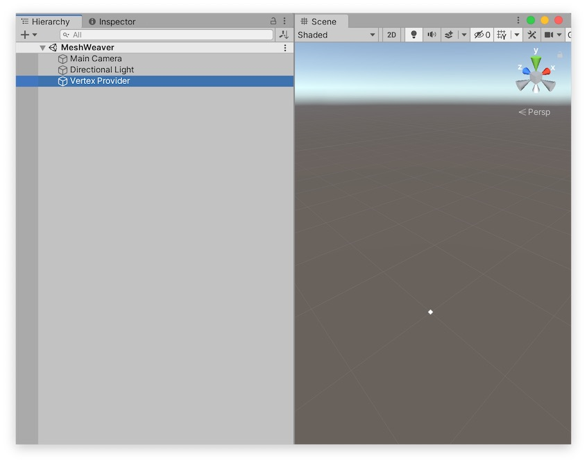
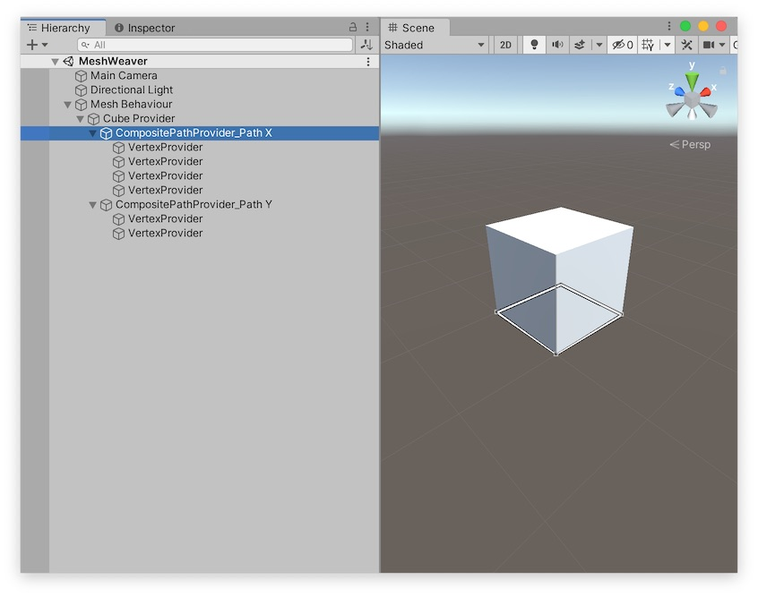
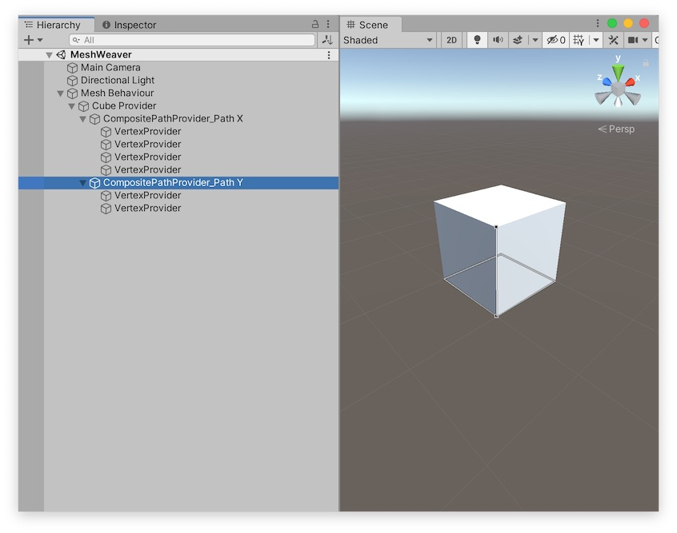

# 最初の一歩

## プリミティブを見る

ヒエラルキーを右クリック→「MeshWeaver」→「Primitives」で構築済みの3Dオブジェクトがいろいろ出てきます。

## 基本の概念

イメージとしては、縦糸（Y軸）と横糸（X軸）を組み合わせて格子状のポリゴンを生成するのが最も多用するワークフローになります。

最もよく使うコンポーネントを例に挙げながら、MeshWeaverの基本的な概念について簡単に説明します。

### パス

**パス**は複数の頂点が連なってできています。
パスはメッシュの素材になります。

パスを定義するには、**PathProvider（パスプロバイダー）コンポーネント**を追加したGameObjectをシーンに追加します。

#### VertexProvider

指定された場所に頂点を生成します。

#### CompositePathProvider

ヒエラルキーで子になっている頂点やパスを受け取り、全て結合したパスを生成します。
CompositePathProviderだけがヒエラルキーで子になっている頂点やパスを受け取ることができます。

つまり、グループ化みたいなことができます。

逆に言うなら、CompositePathProvider以外のPathProviderコンポーネントの親子関係は自由に設定できます。
（もっとも、コンポーネントが利用するパスを子にしておくことでヒエラルキーを整理するのが良いと思います。プリミティブはそのような構造になっています。）

### メッシュ

**メッシュ**は頂点に対してポリゴンを張ったものです。

メッシュを定義するには、**MeshProvider（メッシュプロバイダー）コンポーネント**を追加したGameObjectをシーンに追加します。

#### PolygonMeshProvider

パスを一つ受け取ります。
受け取ったパスに基づいて多角形のポリゴンを生成します。

これを用いて作った四角形が「MeshWeaver」→「Primitives」→「Quad XZ」で出てくる四角ポリゴンです。

オブジェクトを選択すると、一周ぐるっと回るパスが存在することがわかります。
このパスはVertexProviderが入ったCompositePathProviderが生成しているものです。

#### MatrixMeshProvider

パスを二つ受け取ります。
パスを別のパスに沿って動かした軌跡にポリゴンを生成します。

これを用いて作った四角形が「MeshWeaver」→「Primitives」→「Plane」で出てくる地面です。

オブジェクトを選択すると、X軸方向に延びるパスとZ軸方向に延びるパスが存在することがわかります。

「Quad XZ」と「Plane」は出力結果の見た目は似ていますが、構造は異なります。
「Quad XZ」が多角形であるのに対して、「Plane」はX軸方向に延ばしたパスをZ軸方向に動かした軌跡です。

#### PillarMeshProvider

おおむねMatrixMeshProviderと一緒です。
違うのは、一周ぐるっと回ったパスを別のパスに沿って動かした上で、上面と底面にもポリゴンを張れる点です。
これ１つで箱型のオブジェクトが作れるのでとても便利です。

これを用いて作った箱が「MeshWeaver」→「Primitives」→「Cube」で出てくるキューブです。

オブジェクトを選択すると、一周ぐるっと回るパスとY軸方向に延びるパスが存在することがわかります。

#### CompositeMeshProvider

ヒエラルキーで子になっているメッシュを受け取り、全て結合したメッシュを生成します。
CompositeMeshProviderだけがヒエラルキーで子になっているメッシュを受け取ることができます。

つまり、グループ化みたいなことができます。

逆に言うなら、CompositeMeshProvider以外のMeshProviderコンポーネントの親子関係は自由に設定できます。
（もっとも、コンポーネントが利用するメッシュを子にしておくことでヒエラルキーを整理するのが良いと思います。）

### MeshBehaviour

ここまで出てきた頂点やパスやメッシュは、全てMeshWeaverの世界の中でしか存在できないものです。
**MeshBehaviour**は、ヒエラルキーで子になっているメッシュを受け取り、全て結合したメッシュをUnityで使える形式で出力します。
**MeshBehaviourExporter**はそれをプレハブとアセットとして保存します。

## より細かい説明

基本的な概念について補足していきます。

### モディファイア

**パス**や**メッシュ**に**モディファイア**を付与することで、生成されるパスやメッシュを加工できます。
例えば、メッシュの反転や細分化などはモディファイアから設定します。
ほかには、UVの設定はモディファイアから行うことが一般的です。

モディファイアを定義するには、**ModifierProvider（モディファイアプロバイダー）コンポーネント**をPathProviderやMeshProviderに追加します。

モディファイアは、以下のカテゴリに分類されます。

- Mesh: メッシュを加工できます。
- Path: パスを加工できます。
- Vertwise: メッシュとパスの両方を加工できます。頂点単位の操作はこのカテゴリに含まれます。

### TranslationProvider

（上級者向け）

一部のプロバイダーはTransformを参照して出力データを変形・座標変換します。
この際、TransformにTranslationProviderコンポーネントが追加されている場合、追加の変形・座標変換を行うことができます。

### 頂点の詳細

#### UV

**UV**はそれぞれの頂点に対して値が設定されます。

また、１つの頂点は複数のUV情報を持つことができ、これは**UVチャンネル**として表現されます。

これは複数のUVを出力するための機能ではなく、１つの頂点のUVを用途によって読み換えるさいに利用します。
例えば、PillarMeshProviderの本体のUVをUVチャンネル=0で、底面および上面をUVチャンネル=1で設定することで、本体と底面および上面に異なるUVを対応させることができます。ちょっとややこしいですが、プリミティブの「Cube」はそのように設定済みなので、プリミティブを改造すると簡単に作業できます。

VertexProviderから直接頂点のUVを設定することもできますが、ほとんどの場合、UVGeneratorやUvProjectorを使ってUVを自動生成する方がはるかに簡単です。

#### Crease

MeshWeaverにおける**Crease（折り目）**はパス上の頂点に対して設定される概念です。

VertexProviderの `Crease（折り目にする）` をオンにすることで頂点が折り目として設定され、生成される法線が影響を受けます。

内部的には、Creaseは同じ頂点を二回出力しているだけです。
このため、実はVertexProviderをコピーすることでも全く同じことができます。
MeshProviderは頂点の座標が同じ場合はポリゴンを張らないので、この実装により余計なポリゴンが増えることはありません。

### パスの詳細

#### ループ属性

パスには**ループ属性**が設定されていることがあります。
渡されたパスにループ属性が設定されているかどうかで挙動が変わるMeshProviderやモディファイアがあります。（変わらないものもあります。）

### メッシュの詳細

#### マテリアルの設定

メッシュ中のポリゴンに対してマテリアルが設定されます。
マテリアルの設定はそれぞれのMeshProviderから行えますが、設定したマテリアルをMeshBehaviourに反映するには `Collect Materials` （`マテリアルを再収集`）ボタンを押してください。

申し訳ありませんが今のところはここは手動です！！！