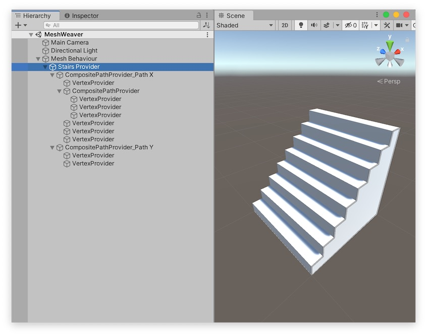
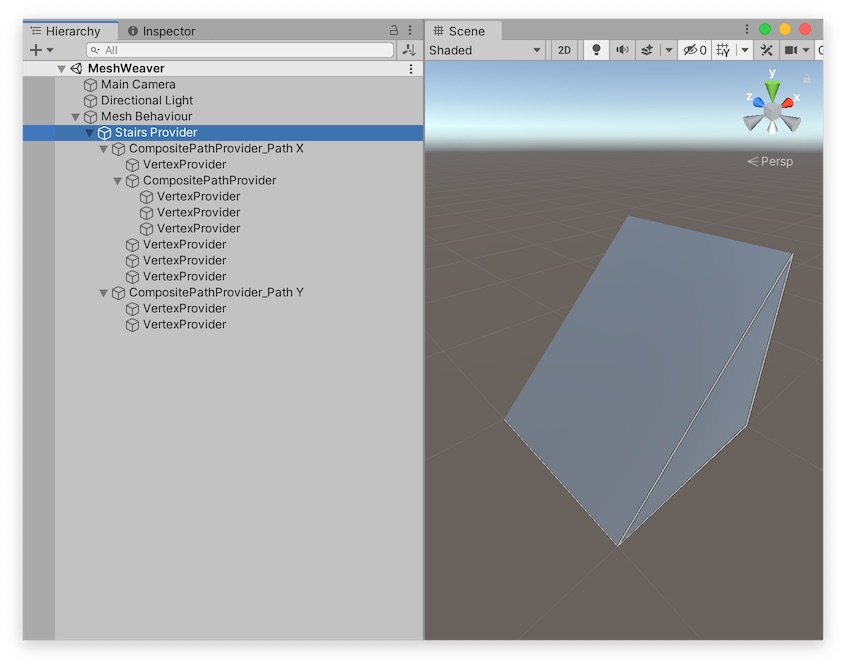

# LOD

## MeshWeaverにおけるLOD

MeshWeaverにおける**LOD（Level of Detail）**とは、ポリゴン数を削減したモデルを生成する仕組みです。

MeshWeaverの各プロバイダーコンポーネントには**LOD Mask（LOD マスク）**を設定することができます。

PathProviderとMeshProviderは、LODレベルがLODマスクに含まれている場合のみ、メッシュやパスを出力します。
LODレベルがLODマスクから外れている場合、何も出力しません。

ModifierProviderは、LODレベルがLODマスクに含まれている場合のみ、モディファイアによるデータの加工が適用されます。
LODレベルがLODマスクから外れている場合、元のデータを出力します。

MeshWeaverには固定で４つのLODが存在します。

- LOD 0 標準的な状態です。
- LOD 1 LOD 0と比較してポリゴン数が省略された状態です。
- LOD 2 更にポリゴン数が省略された状態です。
- Collider メッシュコライダー用の簡略化されたメッシュを定義するレベルです。

### 表示するLOD

MeshWeaverのインスペクタの「表示するLOD」からリアルタイムプレビューで表示するLODレベルを選択できます。

### 出力するLOD

MeshBehaviourExporterからアセットを書き出す場合、まず全てのLODレイヤーのメッシュが書き出されます。プレハブアセットには表示用にLOD 0のメッシュ、MeshProfileがコライダーを利用する設定になっている場合はメッシュコライダーとしてColliderのメッシュが設定されます。

LOD 1とLOD 2のメッシュはデフォルトの設定では利用されません。

## LOD の例

### 階段

これはMeshWeaverでモデリングした階段です。

上の階段のLODを適切に設定することにより、コライダー用のメッシュをこのような形状にすることができます。

## まとめると

レンダラー用のメッシュとコライダー用のメッシュをいっぺんにモデリングするための機能です！
