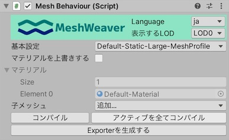
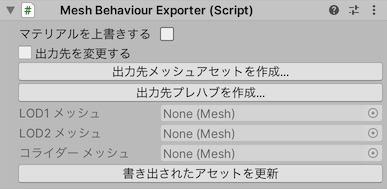

# MeshBehaviour

## MeshBehaviour コンポーネント

MeshWeaverのメッシュを生成した上で、Unityのメッシュに変換するコンポーネントです。

### 作り方

ヒエラルキーを右クリック→「MeshWeaver」→「Mesh Behaviour With Renderer」から作成できます。

または、ヒエラルキーを右クリック→「MeshWeaver」→「Mesh Behaviour」でリアルタイムプレビューが設定されていないMeshBehaviourが作成されます。

### インスペクタ

#### 基本出力設定

「基本設定」からMeshProfileを設定します。

「マテリアル」には、リアルタイムプレビューを行う上で使用するマテリアルが自動で設定されます。
「マテリアルを上書きする」を有効にする事で手動設定も可能になります。

#### メッシュの追加

「子メッシュ」→「追加...」からMeshProviderを追加できます。

#### そのほかの機能

「コンパイル」はMeshBehaviourのリアルタイムプレビューを強制的に再描画します。
リアルタイムプレビューは自動で更新されるためほとんどの場合は押す必要はありませんが、不具合があったら押してください。

「アクティブを全てコンパイル」はシーン上の全てのアクティブなMeshBehaviourに対して「コンパイル」を行います。

「自分自身がMesh Rendererになる事だ」はMeshBehaviourに以下のコンポーネントを追加します。
（「Mesh Behaviour With Renderer」でMeshBehaviourを作成した場合には既に追加済みです。）

- MeshFilter
- MeshRenderer
- MeshCollider

「Exporterを生成する」はMeshBehaviourにMeshBehaviourExporterを追加します。

## MeshBehaviourExporter コンポーネント

MeshBehaviourが生成したメッシュをプレハブとアセットとして保存する設定を行います。

### 作り方

MeshBehaviourのインスペクタから「Exporterを生成する」で、MeshBehaviourにMeshBehaviourExporterを追加します。

### インスペクタ

#### 出力されるアセットのマテリアル設定

MeshBehaviourExporterが出力するプレハブアセットには、MeshBehaviourに設定されたマテリアルが設定されます。
または、「マテリアルを上書きする」から設定されるマテリアルを上書きすることもできます。

#### 出力されるアセットのリンク

MeshBehaviourExporterで最初にアセットを出力する場合、「出力先メッシュアセットの作成...」「出力先プレハブの作成...」から出力先を作成してください。

MeshBehaviourExporterは書き出されたアセットファイルへの参照を保持します。
既に出力先が設定されている場合、「書き出されたアセットを更新」から生成済みのアセットを更新することができます。
あるいは、出力先を「切り離す」か「出力先を変更する」こともできます。
この場合、既にワールドに配置されているプレハブは更新されなくなるので注意してください。

