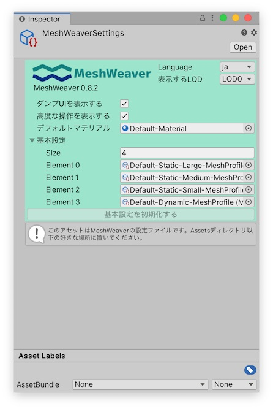

# グローバル設定

## 設定ファイル

このページを読む前にMeshWeaverの言語設定を日本語に切り替えてみた場合、 `Assets` 以下に `MeshWeaverSettings` という名前のアセットが作られていると思います。

このアセットにMeshWeaverの全体的な設定が保存されます。置き場所は `Assets` 以下ならどこでも良いので、好きなディレクトリに入れてください。

### インスペクタ

### よく使う設定

「Language」から表示言語を切り替えます。

「表示するLOD」はリアルタイムプレビューを行う [LOD](lod.md) を選択します。

以上の設定はMeshWeaverのバナーが表示される様々な場所で変更することができます。

### 表示設定

「ダンプUIを表示する」からダンプUIの表示を切り替えます。
多少軽くなるかもしれません。

「高度な操作を表示する」から高度な操作UIの表示を切り替えます。
多少シンプルになるかもしれません。

### 高度な設定

「デフォルトマテリアル」はプリミティブに使用されるのマテリアルを設定します。
Default-Materialだと味気なく感じる場合はここを編集してください。

「基本設定」はMeshBehaviourの基本設定メニューに表示される [MeshProfile](mesh_profile.md) を設定します。
デフォルトのリストに不満がある場合はここを編集してください。
